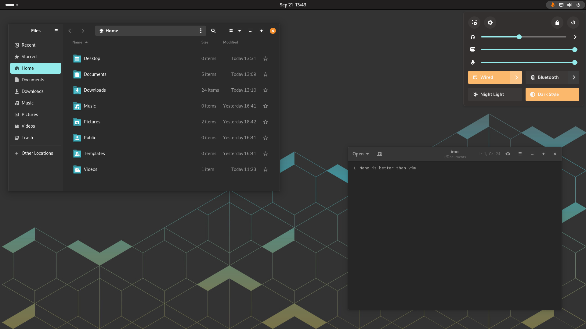

# Pop-dark theme 43+

[](Images/vm_exemple.png)

[[_TOC_]]

## Why is it?

This is a "port" of the Pop-os dark gnome-shell theme for gnome 43+.

I've been trying to keep the Pop-Os spirit and color scheme.

This is my first experience with CSS, and this theme was created for my personal use.

Do not except a bug free experience, this is WIP.

## What's new?

- Redisigned quick settings.
- Redisigned OSD
- Also themed some dialogs.

## How to install

Clone this repository and place the "Pop-dark-43" folder in your .themes directory.

## How to replicate Pop theme experience on any system

In addition to this shell theme, there are several things that can help you get almost the same experience as the official theme.

### Libadwaita theme

Install gnome-tweaks gradience and adw-gtk3 theme.

In gradience, allow for flatpak theming and use the Pop-dark preset.

With this all your GTK4 apps should look like Pop theme.

In gnome-tweaks, select adw-gtk3 theme for legacy applications. This way non GTK apps will use it and have the same window decorations as your GTK4 apps.

### Fix GTK3 window decorations

For some reasons that I don't know, Pop-dark gradience preset does not seems to work with gtk3 applications (it defaults to GTK4 window decorations)

If you're still using GTK3 apps, you can fix it by editing your application desktop file.

Copy it from `/usr/share/applications` to `/home/$USER/.local/share/applications`

Now you can edit the `exec=` line and add `env GTK_THEME=Pop-dark` before the executable.

```
Exec=env GTK_THEME=Pop-dark /usr/lib/firefox/firefox %u
Icon=firefox
```

This way your apps will use Pop-dark GTK3 theme.

## To do

- Light theme
- More polish here and there
- Lock screen
- Fix bugs (you tell me)
